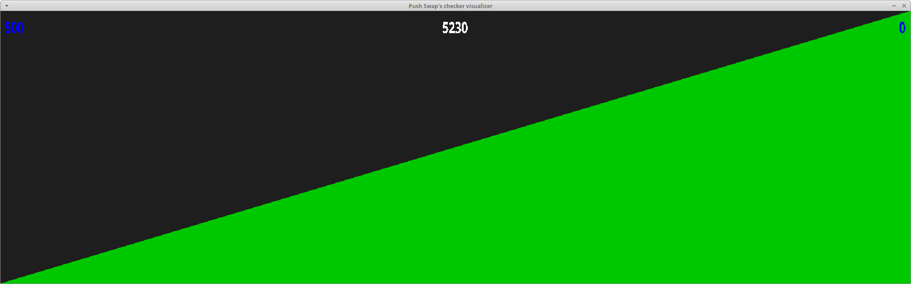

# Push_swap
A 42 school's project. 

> :warning: **Warning**: It is educational project.

> :warning: **Warning**: You can take inspiration from it but don't copy / paste what you don't understand.

# Last changes :
> The makefile automatically install SDL2

# Git status return :
        modifié :         Makefile

In this repository you will find two programs to find and test a sorting algorithm on a stack of int  

**ALGORITHM EXPLANATION**  

It's a three time algorithm:  
  
  
I parse the given stack and mark each digit, by doing so I'm able to tell which number will stay in stack A and whom will be pushed to B.    
    
  
I backtrack in stack B to select the best data to move accordingly to the number of operations needed.    
    
  
I rotate or reverse rotate until the smallest data is at the beginning of the list.    
    

**MAKEFILE GUIDE**  
Thanks to the stack_gen rule you can generate a random list of NB numbers between INT_MIN and INT_MAX:  
make stack_gen NB={WANTED_LIST_SIZE}

The sort and check rules respectively start the ./push_swap and the ./checker software with ARGS as a list:  
make sort ARGS="$(cat STACK.txt)" || make check ARGS="$(cat STACK.txt)"

The make correc and correc_bonus will count the lines returned by push_swap and send it to checker or checker_visualizer:  
make correc(_bonus) ARGS="$(cat STACK.txt)"

If you want to enable fsanitize for the project you can define DEBUG as follow:  
make DEBUG=true
